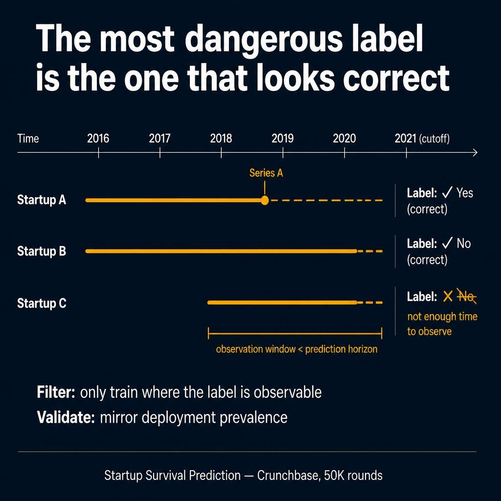

# Telecom Customer Segmentation

Unsupervised behavioral segmentation and supervised rule-based assignment for telecom CVM operations — covering observation-unit design, variable clusterability, iterative profiling, and production deployment.

## Project Website

[View Project Site](https://mah-trigui.github.io/telecom-customer-segmentation/)

## Overview

This project delivered a full customer segmentation system for a telecom operator's CVM campaigns.

The main challenge was not the clustering algorithm. It was the series of design decisions before and after:

- deciding what one row in the analytical base table should represent
- making highly skewed behavioral variables compatible with distance-based methods
- iteratively profiling clusters until they became business-usable segments
- bridging unsupervised discovery to production-ready supervised assignment

**Target:** 834K prepaid subscribers · **Features:** 174 behavioral variables · **Tools:** SAS, Oracle/Toad, R · **Outcome:** Operational CVM segments with automated new-customer assignment

## Architecture



## Core Design Decisions

### 1. Observation Unit Design

The project compared two analytical-table designs:

| Approach | Row definition | What you segment |
|----------|---------------|-----------------|
| A | One subscriber = one row (6-month average) | Customer types |
| B | One subscriber-month = one row | Behavioral states over time |

That choice determines whether the business gets stable long-term profiles or detects behavioral transitions.

### 2. Variable Clusterability

174 candidate variables had extreme skewness (up to 40+) and kurtosis (above 1000). Variable-specific transformations were applied:

- **LOG** — moderate skew (ARPM, NB_Comm, NB_CELL)
- **SQRT** — light skew (NB_JOUR_ACTIVITE, PRCT_4G)
- **Power ^0.25** — heavy skew (MNT_RECHARGE, revenu_total, VOL_FMS)
- **EXP** — reverse distributions (MULTISIM, P_FF_Data)

Result: 49 variables retained, 49 rejected — not for correlation, but because no transform could make them behave in a stable distance space.

### 3. Iterative Profiling

Useful segments emerged through repeated cycles:

```
represent → cluster → profile → rethink → rebuild
```

Each iteration profiled across: recharge behavior, voice/data mix, handset quality, network usage, region/mobility, CVM response, churn signals.

### 4. Compression Before Structure

- **Stage 1:** K-means with many centers → compress 834K rows to representative centroids
- **Stage 2:** Hierarchical clustering (Ward) on centroids → find nested segment structure

### 5. Supervised Rule-Based Assignment

After unsupervised discovery, a decision tree was trained on labeled clusters to extract interpretable rules:

```
Raw tree:    IF ARPU_DATA > 7.34 AND NB_FORFAIT_DATA > 2.17 → "Data Addict"
Adjusted:    IF ARPU_DATA > 7 DT AND NB_FORFAIT_DATA > 2   → "Data Addict"
```

Thresholds were rounded and validated with business teams for:
- new customer assignment (1-4 months of history)
- monthly re-scoring
- CVM campaign targeting without re-running unsupervised pipelines

## Key Principles

| Principle | Application |
|-----------|-------------|
| The unit of analysis is a modeling decision | Customer average vs monthly state |
| Bad shape kills clustering before redundancy does | Skewness > correlation as variable filter |
| Profiling is not cleanup — it is the method | Iterative redesign loop |
| Discovery ≠ Assignment | Unsupervised finds, supervised deploys |
| Business interpretability > model accuracy | Threshold rounding for CVM teams |

## Generalization

The same patterns apply in:
- Banking customers with monthly transaction states
- E-commerce users with lifecycle behavior changes
- Subscription products with engagement-state segmentation
- IoT device populations with operating-state clustering
- Any domain where unsupervised discovery must become production assignment

## Public Repository Scope

This public version shares the segmentation architecture, methodological framing, selected pseudocode, and project presentation. Raw telecom data, confidential schemas, and production identifiers are not included.
